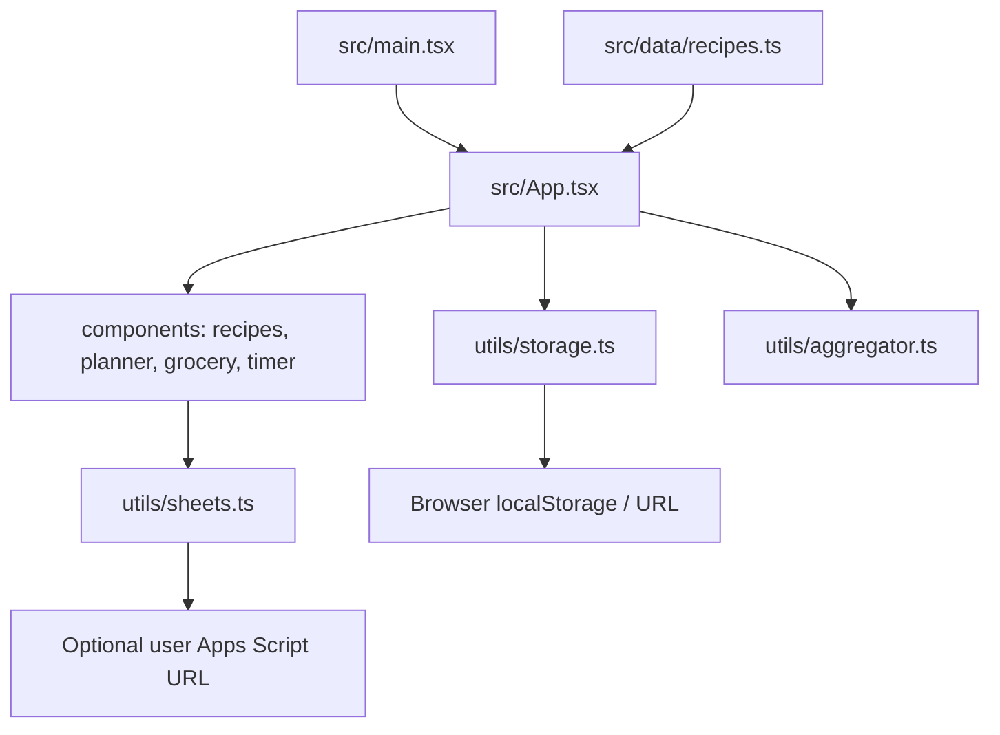

# Architecture

## Summary

Wajba is a client-rendered React application built and served by Vite. `App.tsx` composes the feature views, keeps shared state, and delegates persistence and derived grocery calculations to utility modules.

## Main Modules

| Module | Responsibility |
|---|---|
| `src/main.tsx` | Mount React under `#root` |
| `src/App.tsx` | URL-based landing/dashboard routing, shared state, navigation, and handlers |
| `src/components/` | User-facing views and modals |
| `src/data/recipes.ts` | Bundled runtime recipe catalog |
| `src/utils/storage.ts` | `localStorage`, seed data, shared-plan URL decoding/encoding, pantry and backup state |
| `src/utils/aggregator.ts` | Convert planned recipes into normalized grocery items and subtract compatible pantry quantities |
| `src/utils/sheets.ts` | CSV generation/download and optional remote POST |

## Data / Control Flow

1. `src/main.tsx` mounts `App`.
2. `/` renders the public landing page; `/dashboard` and its tab routes render the dashboard shell.
3. `App` loads language, theme, plans, favorites, votes, custom recipes, grocery state, and timers from browser storage.
4. `App` combines custom recipes with `INITIAL_RECIPES` from `src/data/recipes.ts`.
5. Planner views update weekly/monthly plans; the aggregator derives grocery items from assigned recipe IDs and servings.
6. UI actions save updated state back to `localStorage`.
7. Family sync actions encode a weekly plan into a URL, download files, or send a JSON payload to a user-provided Apps Script URL.

## Diagram

## External Services

- Google Apps Script Web App URL, optional and user-supplied.
- Unsplash/image URLs referenced by recipe data.
- Google Fonts loaded by `index.html`.
- `Unknown / verify`: current deployment platform and whether Gemini is used in a separate runtime.

## Risks / Coupling

- Plans store recipe IDs; changing IDs can orphan saved plans.
- Browser storage is origin-scoped and has no server backup unless the user exports/syncs data.
- Pantry stock is explicitly maintained by the user; checking a grocery item never consumes pantry stock.
- Backup restore validates before replacement and excludes transient active timers.
- Google Sheets sync uses `fetch` with `no-cors`, so the client cannot inspect the remote response.
- `recipes_data.json`, `public/recipes_data.json`, generated JSON, and `src/data/recipes.ts` can drift; the runtime currently reads only the TypeScript catalog.
